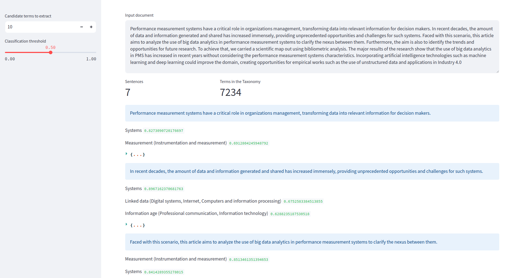

# Instrucciones

Instalar las dependencias:

```
pip install -r requirements.txt
```

Descargar el modelo de `spacy` necesario:

```
spacy download en_core_web_lg
```

Ejecutar la aplicación:

```
streamlit run app.py
```

> **NOTA:** El código en `app.py` puede servir para entender como usar los métodos en `sensorlib.py`.
> En `sensorlib.py` están refactorizados los métodos y funcionalidades necesarias.

### NER en el corpus ISABIAL

Visitar <localhost:8501> para ver el demo de reconocimiento de entidades en el corpus ISABIAL.

### Keyword Extraction IEEE

Visitar <localhost:8501/ieee_taxonomy> para ver el demo de extracción de keywords de la taxonomía IEEE.



En `experiments.py` están los códigos de experimentación de este demo.

> **NOTA**: La primera vez que se ejecuta el código se debe descargar un modelo de `transformers` de 2GB aproximadamente. Esto puede demorar.

## Entrenando el modelo de NER

Para entrenar el modelo de NER, primero hay que convertir los datos al formato de `spacy`:

```
python3 isabial_to_spacy.py
```

En la carpeta `Data`  aparecerán 3 archivos `*.spacy`.

Luego hay dos opciones:

### Modelo CPU (lento y malo)

Es fácil, solo ejecutar:

```
python3 -m spacy train config_cpu.cfg --output ./Data
```

### Modelo GPU

Necesitas instalar `cupy`. Esto es complicado, requiere CUDA y otras dependencias. Sigue las instrucciones [aquí](https://docs.cupy.dev/en/stable/install.html#).

Una vez instalado y correctamente configurado `cupy`, ejecutar:

```
python3 -m spacy train config_gpu.cfg --gpu-id 0 --output ./Data
```

Donde `--gpu-id 0` apunta a la GPU a utilizar (0, 1, etc.)
